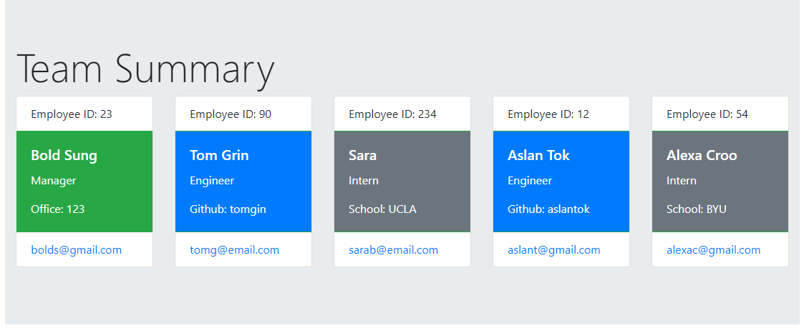

# Template Engine - Employee Summary

One of the most important aspects of programming is writing code that is readable, reliable, and clean. Often times, *how* we design our code is just as important as the code itself. In this small project, I am building a **Node CLI** application that takes in information about employees and generates an HTML webpage that displays summaries for each person. Since testing is a key piece in making code maintainable, I also have unit test cases that run by the Jest test framework.

This is a software engineering team generator command line application. The application prompts the user for information about the team manager and then information about the team members. The user can input any number of team members, and they may be a mix of engineers and interns.

In this application, I also demonstrate object oriented design (OOD). Concretely, there is an employee base class which is extended by manager, engineer and intern classes. In addition, employee input such as name, email, id as well as role-specific properties are obtained and cards are styled. For instance, an intern may provide their school, whereas an engineer may provide their GitHub username.

When the user has completed building the team, the application creates an HTML file that displays a nicely formatted team roster based on the information provided by the user. The `summary.html` is generated in the `output` folder.

This app can be downloaded or cloned locally so that you can run it as `node app.js`.

### Tools and concepts
* [Jest](https://jestjs.io/) for running unit tests with `npm test` command
* [Inquirer](https://www.npmjs.com/package/inquirer) for collecting input from the user on the command line
* Template engine and injection are demonstrated to render data
* OOD, OOP, classes, constructors, inheritence, polymorphism, abstraction, accessiblity
* Bootstrap CSS Framework for styling cards
* Node.JS and Node CLI
* Async and await
* Modularization and folder structure (test, lib, src)

### Usage
* `node app.js` to generate the summary
* `npm run test` to execute unit tests

